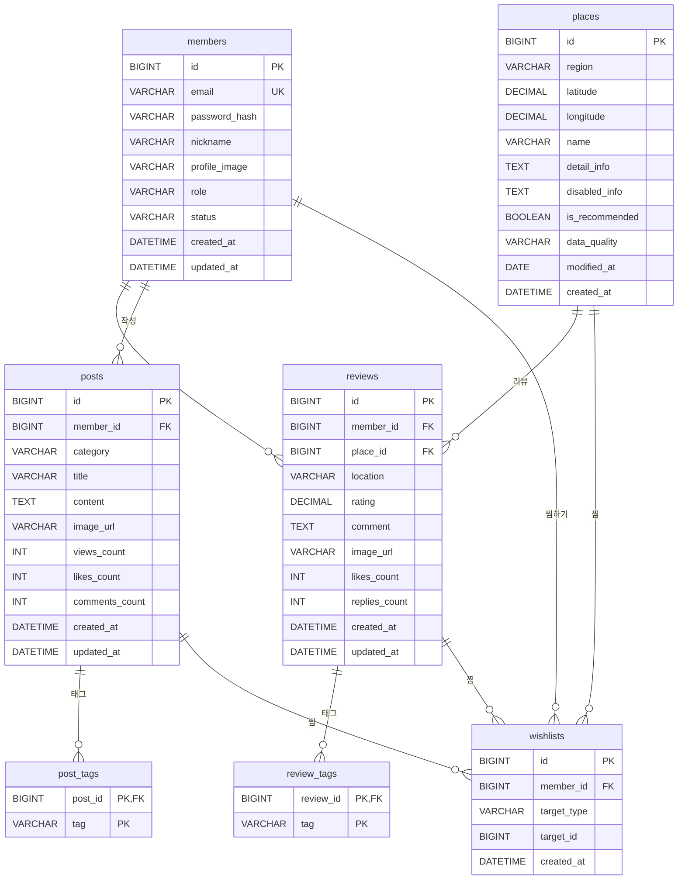

# 제주 리뷰 앱 DB 설계 문서

제주 리뷰 앱(Jeju Reviews)의 전체 데이터베이스 구조 설계 문서입니다.  
회원, 리뷰, 게시물, 장소, 찜 기능을 포함한 완전한 스키마와 SQL 쿼리를 제공합니다.

---

## 목차

1. [기능 개요](#1-기능-개요)
2. [테이블 스키마](#2-테이블-스키마)
3. [ER 다이어그램](#3-er-다이어그램)
4. [SQL 쿼리](#4-sql-쿼리)
5. [프론트엔드 연동 가이드](#5-프론트엔드-연동-가이드)

---

## 1. 기능 개요

| 기능 | 설명 |
|------|------|
| **회원 관리** | 회원가입, 로그인, 프로필 수정, 회원 탈퇴 |
| **리뷰** | 장소에 대한 평가/후기 작성, 태그, 좋아요, 댓글 |
| **게시물** | 커뮤니티 게시글 (자유, 질문, 정보 공유 등), 카테고리별 분류 |
| **장소** | 제주도 관광지 정보 (CSV 데이터), 지역별/키워드 검색 |
| **찜** | 리뷰, 게시물, 장소를 찜하기 (다형성 관계) |

---

## 2. 테이블 스키마

### 2.1 회원 테이블 (`members`)

회원 정보를 저장하는 테이블입니다.

```sql
CREATE TABLE members (
  id            BIGINT       PRIMARY KEY AUTO_INCREMENT,
  email         VARCHAR(255) NOT NULL UNIQUE COMMENT '이메일 (로그인 ID)',
  password_hash VARCHAR(255) NOT NULL COMMENT 'bcrypt 등 해시된 비밀번호',
  nickname      VARCHAR(50)  NOT NULL COMMENT '닉네임',
  profile_image VARCHAR(512) DEFAULT NULL COMMENT '프로필 이미지 URL',
  role          VARCHAR(20)  NOT NULL DEFAULT 'USER' COMMENT 'USER, ADMIN',
  status        VARCHAR(20)  NOT NULL DEFAULT 'ACTIVE' COMMENT 'ACTIVE, SUSPENDED, WITHDRAWN',
  created_at    DATETIME     NOT NULL DEFAULT CURRENT_TIMESTAMP,
  updated_at    DATETIME     NOT NULL DEFAULT CURRENT_TIMESTAMP ON UPDATE CURRENT_TIMESTAMP,
  INDEX idx_members_email (email),
  INDEX idx_members_status (status),
  INDEX idx_members_nickname (nickname)
) ENGINE=InnoDB DEFAULT CHARSET=utf8mb4 COLLATE=utf8mb4_unicode_ci;
```

**컬럼 설명:**
- `id`: 회원 고유 ID (자동 증가)
- `email`: 이메일 주소 (UNIQUE, 로그인 ID로 사용)
- `password_hash`: 해시된 비밀번호 (bcrypt 등 사용)
- `nickname`: 사용자 닉네임
- `profile_image`: 프로필 이미지 URL (선택)
- `role`: 역할 (USER: 일반 사용자, ADMIN: 관리자)
- `status`: 계정 상태 (ACTIVE: 활성, SUSPENDED: 정지, WITHDRAWN: 탈퇴)
- `created_at`: 가입일시
- `updated_at`: 수정일시

---

### 2.2 리뷰 테이블 (`reviews`)

장소에 대한 리뷰/평가를 저장하는 테이블입니다.

```sql
CREATE TABLE reviews (
  id            BIGINT       PRIMARY KEY AUTO_INCREMENT,
  member_id     BIGINT       NOT NULL COMMENT '작성자 ID',
  place_id      BIGINT       DEFAULT NULL COMMENT '연관된 장소 ID (places.id)',
  location      VARCHAR(255) NOT NULL COMMENT '장소명 (place_id가 없을 때 사용)',
  rating        DECIMAL(2,1) NOT NULL COMMENT '평점 (0.0 ~ 5.0)',
  comment       TEXT         NOT NULL COMMENT '리뷰 내용',
  image_url     VARCHAR(512) DEFAULT NULL COMMENT '리뷰 이미지 URL',
  likes_count   INT          NOT NULL DEFAULT 0 COMMENT '좋아요 수',
  replies_count INT          NOT NULL DEFAULT 0 COMMENT '댓글 수',
  created_at    DATETIME     NOT NULL DEFAULT CURRENT_TIMESTAMP,
  updated_at    DATETIME     NOT NULL DEFAULT CURRENT_TIMESTAMP ON UPDATE CURRENT_TIMESTAMP,
  FOREIGN KEY (member_id) REFERENCES members(id) ON DELETE CASCADE,
  FOREIGN KEY (place_id) REFERENCES places(id) ON DELETE SET NULL,
  INDEX idx_reviews_member (member_id),
  INDEX idx_reviews_place (place_id),
  INDEX idx_reviews_created (created_at),
  INDEX idx_reviews_rating (rating)
) ENGINE=InnoDB DEFAULT CHARSET=utf8mb4 COLLATE=utf8mb4_unicode_ci;
```

**컬럼 설명:**
- `id`: 리뷰 고유 ID
- `member_id`: 작성자 ID (members.id 참조)
- `place_id`: 연관된 장소 ID (places.id 참조, 선택)
- `location`: 장소명 (place_id가 없을 때 사용, 하위 호환성)
- `rating`: 평점 (0.0 ~ 5.0)
- `comment`: 리뷰 내용
- `image_url`: 리뷰 이미지 URL (선택)
- `likes_count`: 좋아요 수 (캐시)
- `replies_count`: 댓글 수 (캐시)

**리뷰-태그 다대다 테이블:**

```sql
CREATE TABLE review_tags (
  review_id BIGINT NOT NULL,
  tag       VARCHAR(50) NOT NULL COMMENT '태그명 (예: 바다뷰, 주차가능)',
  PRIMARY KEY (review_id, tag),
  FOREIGN KEY (review_id) REFERENCES reviews(id) ON DELETE CASCADE,
  INDEX idx_review_tags_tag (tag)
) ENGINE=InnoDB DEFAULT CHARSET=utf8mb4 COLLATE=utf8mb4_unicode_ci;
```

---

### 2.3 게시물 테이블 (`posts`)

커뮤니티 게시글을 저장하는 테이블입니다.

```sql
CREATE TABLE posts (
  id            BIGINT       PRIMARY KEY AUTO_INCREMENT,
  member_id     BIGINT       NOT NULL COMMENT '작성자 ID',
  category      VARCHAR(50)  NOT NULL DEFAULT 'GENERAL' COMMENT 'GENERAL, QUESTION, INFO, REVIEW',
  title         VARCHAR(255) NOT NULL COMMENT '제목',
  content       TEXT         NOT NULL COMMENT '내용',
  image_url     VARCHAR(512) DEFAULT NULL COMMENT '이미지 URL',
  views_count   INT          NOT NULL DEFAULT 0 COMMENT '조회수',
  likes_count   INT          NOT NULL DEFAULT 0 COMMENT '좋아요 수',
  comments_count INT         NOT NULL DEFAULT 0 COMMENT '댓글 수',
  created_at    DATETIME     NOT NULL DEFAULT CURRENT_TIMESTAMP,
  updated_at    DATETIME     NOT NULL DEFAULT CURRENT_TIMESTAMP ON UPDATE CURRENT_TIMESTAMP,
  FOREIGN KEY (member_id) REFERENCES members(id) ON DELETE CASCADE,
  INDEX idx_posts_member (member_id),
  INDEX idx_posts_category (category),
  INDEX idx_posts_created (created_at),
  INDEX idx_posts_title (title(100))
) ENGINE=InnoDB DEFAULT CHARSET=utf8mb4 COLLATE=utf8mb4_unicode_ci;
```

**컬럼 설명:**
- `id`: 게시물 고유 ID
- `member_id`: 작성자 ID (members.id 참조)
- `category`: 카테고리 (GENERAL: 자유, QUESTION: 질문, INFO: 정보, REVIEW: 리뷰)
- `title`: 제목
- `content`: 내용
- `image_url`: 이미지 URL (선택)
- `views_count`: 조회수 (캐시)
- `likes_count`: 좋아요 수 (캐시)
- `comments_count`: 댓글 수 (캐시)

**게시물-태그 다대다 테이블:**

```sql
CREATE TABLE post_tags (
  post_id BIGINT NOT NULL,
  tag     VARCHAR(50) NOT NULL COMMENT '태그명',
  PRIMARY KEY (post_id, tag),
  FOREIGN KEY (post_id) REFERENCES posts(id) ON DELETE CASCADE,
  INDEX idx_post_tags_tag (tag)
) ENGINE=InnoDB DEFAULT CHARSET=utf8mb4 COLLATE=utf8mb4_unicode_ci;
```

---

### 2.4 장소 테이블 (`places`)

제주도 관광지 정보를 저장하는 테이블입니다. CSV 데이터를 기반으로 합니다.

```sql
CREATE TABLE places (
  id              BIGINT       PRIMARY KEY AUTO_INCREMENT,
  region          VARCHAR(100) NOT NULL COMMENT '지역명 (예: 법환포구, 해녀박물관)',
  latitude        DECIMAL(10,8) NOT NULL COMMENT '위도',
  longitude       DECIMAL(11,8) NOT NULL COMMENT '경도',
  name            VARCHAR(255) NOT NULL COMMENT '장소명칭',
  detail_info     TEXT         DEFAULT NULL COMMENT '장소상세정보',
  disabled_info   TEXT         DEFAULT NULL COMMENT '무장애관광정보',
  is_recommended  BOOLEAN      NOT NULL DEFAULT FALSE COMMENT '추천코스여부',
  data_quality    VARCHAR(50)  DEFAULT NULL COMMENT '데이터품질점검결과',
  modified_at     DATE         DEFAULT NULL COMMENT '데이터기준일자',
  created_at      DATETIME     NOT NULL DEFAULT CURRENT_TIMESTAMP,
  INDEX idx_places_region (region),
  INDEX idx_places_location (latitude, longitude),
  INDEX idx_places_name (name),
  INDEX idx_places_recommended (is_recommended)
) ENGINE=InnoDB DEFAULT CHARSET=utf8mb4 COLLATE=utf8mb4_unicode_ci;
```

**컬럼 설명:**
- `id`: 장소 고유 ID
- `region`: 지역명 (예: 법환포구, 해녀박물관, 동문시장)
- `latitude`: 위도
- `longitude`: 경도
- `name`: 장소명칭
- `detail_info`: 장소 상세 정보
- `disabled_info`: 무장애 관광 정보
- `is_recommended`: 추천 코스 여부
- `data_quality`: 데이터 품질 점검 결과
- `modified_at`: 데이터 기준일자

---

### 2.5 찜 테이블 (`wishlists`) - 확장 버전

리뷰, 게시물, 장소 모두 찜할 수 있도록 다형성 관계로 설계된 테이블입니다.

```sql
CREATE TABLE wishlists (
  id          BIGINT   PRIMARY KEY AUTO_INCREMENT,
  member_id   BIGINT   NOT NULL COMMENT '회원 ID',
  target_type VARCHAR(20) NOT NULL COMMENT 'REVIEW, POST, PLACE',
  target_id   BIGINT   NOT NULL COMMENT '찜한 대상의 ID',
  created_at  DATETIME NOT NULL DEFAULT CURRENT_TIMESTAMP,
  UNIQUE KEY uk_wishlist_member_target (member_id, target_type, target_id),
  FOREIGN KEY (member_id) REFERENCES members(id) ON DELETE CASCADE,
  INDEX idx_wishlists_member (member_id),
  INDEX idx_wishlists_target (target_type, target_id),
  INDEX idx_wishlists_created (created_at)
) ENGINE=InnoDB DEFAULT CHARSET=utf8mb4 COLLATE=utf8mb4_unicode_ci;
```

**컬럼 설명:**
- `id`: 찜 고유 ID
- `member_id`: 회원 ID (members.id 참조)
- `target_type`: 찜 대상 타입 (REVIEW: 리뷰, POST: 게시물, PLACE: 장소)
- `target_id`: 찜 대상의 ID (target_type에 따라 reviews.id, posts.id, places.id 중 하나)
- `created_at`: 찜한 일시

**찜 타입별 설명:**
- `REVIEW`: 리뷰를 찜함 (target_id = reviews.id)
- `POST`: 게시물을 찜함 (target_id = posts.id)
- `PLACE`: 장소를 찜함 (target_id = places.id)

---

## 3. ER 다이어그램



---

## 4. SQL 쿼리

### 4.1 회원 관련 쿼리

#### 4.1.1 회원가입

```sql
INSERT INTO members (email, password_hash, nickname, role, status)
VALUES (?, ?, ?, 'USER', 'ACTIVE');
```

#### 4.1.2 로그인 시 회원 조회 (이메일)

```sql
SELECT id, email, password_hash, nickname, profile_image, role, status, created_at
FROM members
WHERE email = ? AND status = 'ACTIVE';
```

#### 4.1.3 회원 조회 (ID)

```sql
SELECT id, email, nickname, profile_image, role, status, created_at, updated_at
FROM members
WHERE id = ? AND status = 'ACTIVE';
```

#### 4.1.4 닉네임/프로필 수정

```sql
UPDATE members
SET nickname = ?, profile_image = ?, updated_at = CURRENT_TIMESTAMP
WHERE id = ?;
```

#### 4.1.5 비밀번호 변경

```sql
UPDATE members
SET password_hash = ?, updated_at = CURRENT_TIMESTAMP
WHERE id = ?;
```

#### 4.1.6 회원 탈퇴 (soft delete)

```sql
UPDATE members
SET status = 'WITHDRAWN', updated_at = CURRENT_TIMESTAMP
WHERE id = ?;
```

#### 4.1.7 이메일 중복 확인

```sql
SELECT 1 FROM members WHERE email = ? LIMIT 1;
```

---

### 4.2 리뷰 관련 쿼리

#### 4.2.1 리뷰 작성

```sql
INSERT INTO reviews (member_id, place_id, location, rating, comment, image_url)
VALUES (?, ?, ?, ?, ?, ?);

-- 태그 추가 (여러 개)
INSERT INTO review_tags (review_id, tag) VALUES (?, ?), (?, ?), ...;
```

#### 4.2.2 리뷰 목록 조회 (검색/필터)

```sql
SELECT r.id, r.member_id, r.place_id, r.location, r.rating, r.comment, r.image_url,
       r.likes_count, r.replies_count, r.created_at,
       m.nickname AS author_nickname, m.profile_image AS author_profile_image,
       p.name AS place_name, p.region AS place_region
FROM reviews r
JOIN members m ON r.member_id = m.id
LEFT JOIN places p ON r.place_id = p.id
WHERE m.status = 'ACTIVE'
  AND (? IS NULL OR r.place_id = ?)
  AND (? IS NULL OR r.location LIKE ? OR r.comment LIKE ?)
  AND (? IS NULL OR r.rating >= ?)
ORDER BY r.created_at DESC
LIMIT ? OFFSET ?;
```

#### 4.2.3 리뷰 상세 조회

```sql
SELECT r.id, r.member_id, r.place_id, r.location, r.rating, r.comment, r.image_url,
       r.likes_count, r.replies_count, r.created_at, r.updated_at,
       m.nickname AS author_nickname, m.profile_image AS author_profile_image,
       p.name AS place_name, p.region AS place_region, p.latitude, p.longitude
FROM reviews r
JOIN members m ON r.member_id = m.id
LEFT JOIN places p ON r.place_id = p.id
WHERE r.id = ? AND m.status = 'ACTIVE';

-- 태그 조회
SELECT tag FROM review_tags WHERE review_id = ?;
```

#### 4.2.4 태그별 리뷰 조회

```sql
SELECT r.id, r.member_id, r.location, r.rating, r.comment, r.image_url,
       r.likes_count, r.replies_count, r.created_at,
       m.nickname AS author_nickname
FROM reviews r
JOIN members m ON r.member_id = m.id
JOIN review_tags rt ON r.id = rt.review_id
WHERE rt.tag = ? AND m.status = 'ACTIVE'
ORDER BY r.created_at DESC
LIMIT ? OFFSET ?;
```

#### 4.2.5 리뷰 수정

```sql
UPDATE reviews
SET location = ?, rating = ?, comment = ?, image_url = ?, updated_at = CURRENT_TIMESTAMP
WHERE id = ? AND member_id = ?;
```

#### 4.2.6 리뷰 삭제

```sql
DELETE FROM reviews WHERE id = ? AND member_id = ?;
```

---

### 4.3 게시물 관련 쿼리

#### 4.3.1 게시물 작성

```sql
INSERT INTO posts (member_id, category, title, content, image_url)
VALUES (?, ?, ?, ?, ?);

-- 태그 추가 (여러 개)
INSERT INTO post_tags (post_id, tag) VALUES (?, ?), (?, ?), ...;
```

#### 4.3.2 게시물 목록 조회 (검색/필터)

```sql
SELECT p.id, p.member_id, p.category, p.title, p.content, p.image_url,
       p.views_count, p.likes_count, p.comments_count, p.created_at,
       m.nickname AS author_nickname, m.profile_image AS author_profile_image
FROM posts p
JOIN members m ON p.member_id = m.id
WHERE m.status = 'ACTIVE'
  AND (? IS NULL OR p.category = ?)
  AND (? IS NULL OR p.title LIKE ? OR p.content LIKE ?)
ORDER BY p.created_at DESC
LIMIT ? OFFSET ?;
```

#### 4.3.3 게시물 상세 조회

```sql
SELECT p.id, p.member_id, p.category, p.title, p.content, p.image_url,
       p.views_count, p.likes_count, p.comments_count, p.created_at, p.updated_at,
       m.nickname AS author_nickname, m.profile_image AS author_profile_image
FROM posts p
JOIN members m ON p.member_id = m.id
WHERE p.id = ? AND m.status = 'ACTIVE';

-- 태그 조회
SELECT tag FROM post_tags WHERE post_id = ?;

-- 조회수 증가
UPDATE posts SET views_count = views_count + 1 WHERE id = ?;
```

#### 4.3.4 카테고리별 게시물 조회

```sql
SELECT p.id, p.member_id, p.category, p.title, p.content, p.image_url,
       p.views_count, p.likes_count, p.comments_count, p.created_at,
       m.nickname AS author_nickname
FROM posts p
JOIN members m ON p.member_id = m.id
WHERE p.category = ? AND m.status = 'ACTIVE'
ORDER BY p.created_at DESC
LIMIT ? OFFSET ?;
```

#### 4.3.5 게시물 수정

```sql
UPDATE posts
SET title = ?, content = ?, image_url = ?, category = ?, updated_at = CURRENT_TIMESTAMP
WHERE id = ? AND member_id = ?;
```

#### 4.3.6 게시물 삭제

```sql
DELETE FROM posts WHERE id = ? AND member_id = ?;
```

---

### 4.4 장소 관련 쿼리

#### 4.4.1 장소 검색 (키워드/지역)

```sql
SELECT id, region, latitude, longitude, name, detail_info, disabled_info,
       is_recommended, data_quality, modified_at
FROM places
WHERE (? IS NULL OR region = ?)
  AND (? IS NULL OR name LIKE ? OR detail_info LIKE ?)
  AND (? IS NULL OR is_recommended = ?)
ORDER BY name
LIMIT ? OFFSET ?;
```

#### 4.4.2 지역별 장소 조회

```sql
SELECT id, region, latitude, longitude, name, detail_info, disabled_info,
       is_recommended, data_quality, modified_at
FROM places
WHERE region = ?
ORDER BY name;
```

#### 4.4.3 추천 코스 장소 조회

```sql
SELECT id, region, latitude, longitude, name, detail_info, disabled_info,
       is_recommended, data_quality, modified_at
FROM places
WHERE is_recommended = TRUE
ORDER BY region, name;
```

#### 4.4.4 장소 상세 조회

```sql
SELECT id, region, latitude, longitude, name, detail_info, disabled_info,
       is_recommended, data_quality, modified_at, created_at
FROM places
WHERE id = ?;
```

---

### 4.5 찜 관련 쿼리 (확장 버전)

#### 4.5.1 찜 추가

```sql
INSERT INTO wishlists (member_id, target_type, target_id)
VALUES (?, ?, ?);
-- 이미 있으면 UNIQUE 제약으로 에러 → 클라이언트에서 "이미 찜함" 처리
```

**사용 예시:**
- 리뷰 찜: `INSERT INTO wishlists (member_id, target_type, target_id) VALUES (1, 'REVIEW', 5);`
- 게시물 찜: `INSERT INTO wishlists (member_id, target_type, target_id) VALUES (1, 'POST', 3);`
- 장소 찜: `INSERT INTO wishlists (member_id, target_type, target_id) VALUES (1, 'PLACE', 10);`

#### 4.5.2 찜 해제

```sql
DELETE FROM wishlists
WHERE member_id = ? AND target_type = ? AND target_id = ?;
```

#### 4.5.3 찜 여부 확인

```sql
SELECT 1 FROM wishlists
WHERE member_id = ? AND target_type = ? AND target_id = ?
LIMIT 1;
```

#### 4.5.4 회원의 찜한 리뷰 ID 목록

```sql
SELECT target_id AS review_id
FROM wishlists
WHERE member_id = ? AND target_type = 'REVIEW';
```

#### 4.5.5 회원의 찜한 게시물 ID 목록

```sql
SELECT target_id AS post_id
FROM wishlists
WHERE member_id = ? AND target_type = 'POST';
```

#### 4.5.6 회원의 찜한 장소 ID 목록

```sql
SELECT target_id AS place_id
FROM wishlists
WHERE member_id = ? AND target_type = 'PLACE';
```

#### 4.5.7 리뷰 찜 목록 (상세 정보 포함)

```sql
SELECT w.id, w.created_at AS wishlisted_at,
       r.id AS review_id, r.member_id, r.location, r.rating, r.comment, r.image_url,
       r.likes_count, r.replies_count, r.created_at,
       m.nickname AS author_nickname, m.profile_image AS author_profile_image
FROM wishlists w
JOIN reviews r ON w.target_id = r.id
JOIN members m ON r.member_id = m.id
WHERE w.member_id = ? AND w.target_type = 'REVIEW' AND m.status = 'ACTIVE'
ORDER BY w.created_at DESC;
```

#### 4.5.8 게시물 찜 목록 (상세 정보 포함)

```sql
SELECT w.id, w.created_at AS wishlisted_at,
       p.id AS post_id, p.member_id, p.category, p.title, p.content, p.image_url,
       p.views_count, p.likes_count, p.comments_count, p.created_at,
       m.nickname AS author_nickname, m.profile_image AS author_profile_image
FROM wishlists w
JOIN posts p ON w.target_id = p.id
JOIN members m ON p.member_id = m.id
WHERE w.member_id = ? AND w.target_type = 'POST' AND m.status = 'ACTIVE'
ORDER BY w.created_at DESC;
```

#### 4.5.9 장소 찜 목록 (상세 정보 포함)

```sql
SELECT w.id, w.created_at AS wishlisted_at,
       pl.id AS place_id, pl.region, pl.latitude, pl.longitude, pl.name,
       pl.detail_info, pl.disabled_info, pl.is_recommended
FROM wishlists w
JOIN places pl ON w.target_id = pl.id
WHERE w.member_id = ? AND w.target_type = 'PLACE'
ORDER BY w.created_at DESC;
```

#### 4.5.10 전체 찜 목록 (타입별 구분)

```sql
-- 리뷰 찜
SELECT 'REVIEW' AS type, w.target_id AS id, w.created_at
FROM wishlists w
WHERE w.member_id = ? AND w.target_type = 'REVIEW'

UNION ALL

-- 게시물 찜
SELECT 'POST' AS type, w.target_id AS id, w.created_at
FROM wishlists w
WHERE w.member_id = ? AND w.target_type = 'POST'

UNION ALL

-- 장소 찜
SELECT 'PLACE' AS type, w.target_id AS id, w.created_at
FROM wishlists w
WHERE w.member_id = ? AND w.target_type = 'PLACE'

ORDER BY created_at DESC;
```

---

## 5. 프론트엔드 연동 가이드

### 5.1 회원 기능

#### 회원가입

```javascript
// API 호출 예시
const response = await fetch('/api/members', {
  method: 'POST',
  headers: { 'Content-Type': 'application/json' },
  body: JSON.stringify({
    email: 'user@example.com',
    password: 'hashed_password', // 프론트엔드에서 해시 처리
    nickname: '제주나그네'
  })
});
```

#### 로그인

```javascript
const response = await fetch('/api/members/login', {
  method: 'POST',
  headers: { 'Content-Type': 'application/json' },
  body: JSON.stringify({
    email: 'user@example.com',
    password: 'hashed_password'
  })
});

const { id, email, nickname, profileImage } = await response.json();
// 세션/JWT 저장
```

### 5.2 리뷰 기능

#### 리뷰 목록 조회

```javascript
// 태그 필터링
const reviews = await fetch(`/api/reviews?tag=바다뷰`).then(r => r.json());

// 키워드 검색
const reviews = await fetch(`/api/reviews?keyword=성산일출봉`).then(r => r.json());

// 장소별 조회
const reviews = await fetch(`/api/reviews?place_id=5`).then(r => r.json());
```

#### 리뷰 작성

```javascript
const response = await fetch('/api/reviews', {
  method: 'POST',
  headers: { 'Content-Type': 'application/json' },
  body: JSON.stringify({
    member_id: currentUser.id,
    place_id: 5, // 선택
    location: '서귀포 성산일출봉',
    rating: 4.9,
    comment: '정말 아름다운 일출이었습니다.',
    image_url: 'https://...',
    tags: ['바다뷰', '일출맛집']
  })
});
```

### 5.3 게시물 기능

#### 게시물 목록 조회

```javascript
// 카테고리별 조회
const posts = await fetch(`/api/posts?category=QUESTION`).then(r => r.json());

// 키워드 검색
const posts = await fetch(`/api/posts?keyword=제주도`).then(r => r.json());
```

#### 게시물 작성

```javascript
const response = await fetch('/api/posts', {
  method: 'POST',
  headers: { 'Content-Type': 'application/json' },
  body: JSON.stringify({
    member_id: currentUser.id,
    category: 'QUESTION',
    title: '제주도 여행 코스 추천해주세요',
    content: '3박 4일 일정으로...',
    tags: ['여행코스', '질문']
  })
});
```

### 5.4 장소 기능

#### 장소 검색

```javascript
// 지역별 조회
const places = await fetch(`/api/places?region=법환포구`).then(r => r.json());

// 키워드 검색
const places = await fetch(`/api/places?keyword=해수욕장`).then(r => r.json());

// 추천 코스만 조회
const places = await fetch(`/api/places?recommended=true`).then(r => r.json());
```

### 5.5 찜 기능

#### 찜 추가/해제

```javascript
// 리뷰 찜하기
await fetch('/api/wishlists', {
  method: 'POST',
  headers: { 'Content-Type': 'application/json' },
  body: JSON.stringify({
    member_id: currentUser.id,
    target_type: 'REVIEW',
    target_id: reviewId
  })
});

// 찜 해제
await fetch(`/api/wishlists?member_id=${currentUser.id}&target_type=REVIEW&target_id=${reviewId}`, {
  method: 'DELETE'
});
```

#### 찜 목록 조회

```javascript
// 리뷰 찜 목록
const wishlistedReviews = await fetch(`/api/wishlists?member_id=${currentUser.id}&type=REVIEW`).then(r => r.json());

// 게시물 찜 목록
const wishlistedPosts = await fetch(`/api/wishlists?member_id=${currentUser.id}&type=POST`).then(r => r.json());

// 장소 찜 목록
const wishlistedPlaces = await fetch(`/api/wishlists?member_id=${currentUser.id}&type=PLACE`).then(r => r.json());
```

### 5.6 주의사항

1. **비밀번호 처리**: 프론트엔드에서 비밀번호를 해시화하지 말고, 백엔드에서 처리하세요.
2. **인증**: 모든 API 요청에 인증 토큰(JWT 등)을 포함하세요.
3. **에러 처리**: UNIQUE 제약 위반 등 DB 에러를 적절히 처리하세요.
4. **페이징**: 목록 조회 시 `LIMIT`과 `OFFSET`을 사용하여 페이징을 구현하세요.
5. **캐시 필드**: `likes_count`, `replies_count`, `views_count` 등은 실제 데이터와 동기화해야 합니다.

---

## 6. 마이그레이션 가이드

### 6.1 기존 wishlists 테이블 마이그레이션

기존 `review_id`만 있는 wishlists 테이블을 확장 버전으로 마이그레이션:

```sql
-- 1. 새 테이블 생성
CREATE TABLE wishlists_new (
  id          BIGINT   PRIMARY KEY AUTO_INCREMENT,
  member_id   BIGINT   NOT NULL,
  target_type VARCHAR(20) NOT NULL DEFAULT 'REVIEW',
  target_id   BIGINT   NOT NULL,
  created_at  DATETIME NOT NULL DEFAULT CURRENT_TIMESTAMP,
  UNIQUE KEY uk_wishlist_member_target (member_id, target_type, target_id),
  FOREIGN KEY (member_id) REFERENCES members(id) ON DELETE CASCADE,
  INDEX idx_wishlists_member (member_id),
  INDEX idx_wishlists_target (target_type, target_id)
) ENGINE=InnoDB DEFAULT CHARSET=utf8mb4 COLLATE=utf8mb4_unicode_ci;

-- 2. 기존 데이터 마이그레이션
INSERT INTO wishlists_new (member_id, target_type, target_id, created_at)
SELECT member_id, 'REVIEW', review_id, created_at FROM wishlists;

-- 3. 기존 테이블 백업 후 삭제
RENAME TABLE wishlists TO wishlists_backup;
RENAME TABLE wishlists_new TO wishlists;
```

---

이 설계를 기준으로 백엔드(예: Node.js + MySQL, Spring + JPA 등)와 API를 구현하면 됩니다.
